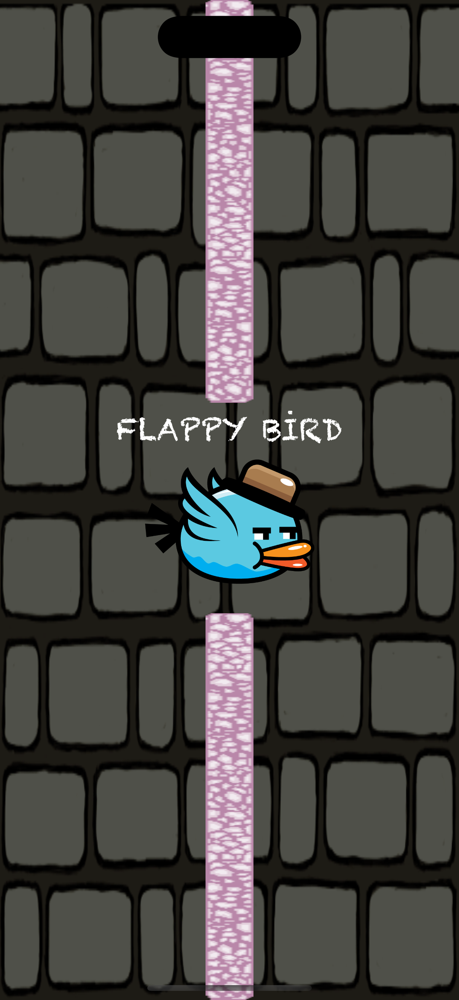
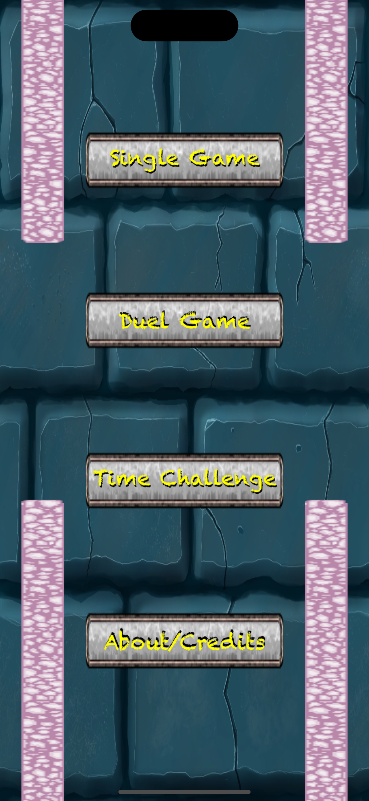
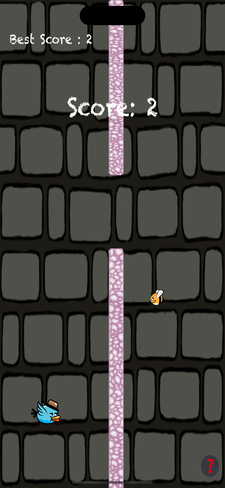
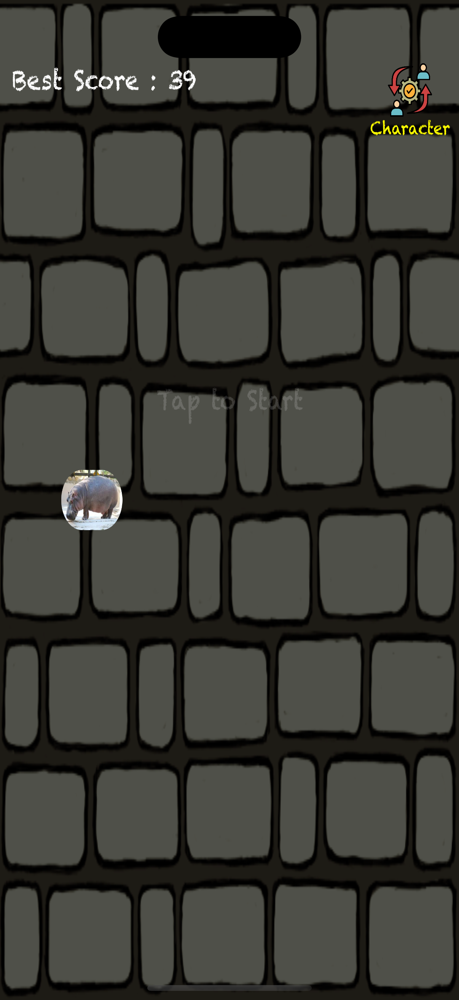
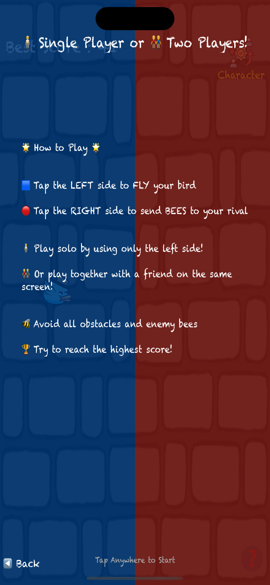

# 🐦 FlappyBird - Custom Character Edition

*Swift* + *SpriteKit* kullanılarak geliştirilen bu Flappy Bird türevi oyun, oyunculara klasik deneyimin ötesinde yepyeni bir kişiselleştirme sunar:  
🎨 Oyuncular, kuş yerine kendi istedikleri görselleri seçerek karakterlerini oluşturabilirler!

---

## 📱 Ekran Görüntüleri

| Giriş Ekranı | Oyun İçi 1 | Oyun İçi 2 | Oyun İçi 3 | Oyun İçi 4 |
|-------------|------------|------------|------------|------------|
|  |  |  |  |  |

---

## 🎮 Özellikler

- 🧠 *Kendi görselini seç, karakterin olsun!*  
  Oyuncular fotoğraf galerilerinden kendi resimlerini seçerek kuş yerine geçirebilirler.

- 🏆 *Skor Sistemi ve Kayıtlı En İyi Skor*  
  UserDefaults ile en iyi skor saklanır ve her oyun sonrası güncellenir.

- 🎯 *Gerçek zamanlı skor artışı*  
  Her engel geçildiğinde skor artar ve ekranda anlık görüntülenir.

- 🧱 *Rastgele yükseklikli engeller*  
  Her oyun farklı bir zorluk sunar.

- 📸 *Karakter Değişim Butonu*  
  Oyunun üst kısmında yer alan "Character" butonuna tıklayarak kuş yerine istediğin görseli kullanabilirsin!

- 🎓 *Çocuklar için ideal*  
  Eğlenceli, sade ve özelleştirilebilir yapısı ile çocuklara özel kullanıcı deneyimi sağlar.

- 🧩 *Yarışmalı veya Sıralamalı Versiyonlar için Uygun Altyapı*  
  Çok oyunculu, lider tablosu, süreli turnuva gibi geliştirmelere uygundur.

---

## 🛠️ Teknoloji ve Kütüphaneler

| Teknoloji | Açıklama |
|----------|----------|
| Swift 5  | Ana programlama dili |
| SpriteKit | 2D fizik tabanlı oyun motoru |
| UIKit    | Görsel arayüz yönetimi |
| AVFoundation | Görsel seçme ve galeriye erişim için gerekli yapı |

---

## 🚀 Başlarken

### Gerekli Adımlar

1. Bu projeyi klonlayın:
```bash
git clone https://github.com/enesbayri/FlappyBird-Swift.git
cd flappyBird
