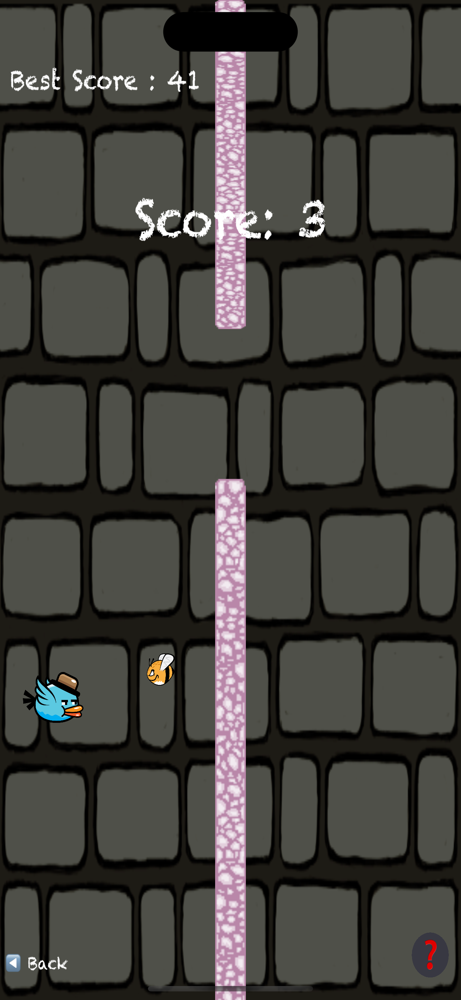

# AirSprint: Sky Duel – Customizable Multiplayer Arcade

**AirSprint: Sky Duel** is a modern, customizable reimagining of classic tap-to-fly mechanics. Designed for both solo and local multiplayer play, the game introduces new strategic elements, user personalization, and fast-paced arcade gameplay — all built with **Swift 5** and **SpriteKit**.

---

## Game Overview

AirSprint is not just another Flappy Bird clone. It's a complete arcade experience with:

- **Single Player Mode**: Classic flappy mechanics to beat your high score  
- **Duel Mode**: Two players on the same screen — one flies, one attacks  
- **Time Challenge Mode**: Score as high as you can in 60 seconds  
- **Character Customization**: Import any photo to replace the default bird  
- **Dynamic Obstacle Generation**: Randomized layout for fresh challenges every time  
- **Tutorial & Info System**: First-time onboarding and persistent help button  
- **Offline Friendly & Ad-Free**: Designed for quick and distraction-free gameplay  

---

## Screenshots

| Loading | Game Start | Single Mode | Duel Mode | Custom Bird |
|--------|------------|-------------|-----------|-------------|
|  |  |  |  |  |

---

## Features Summary

- Custom character support via photo library
- Real-time multiplayer on a single device
- Reflex-based tap controls (left: fly, right: attack)
- Instant restart, randomized difficulty
- Simple UI for kids and adults alike
- Built 100% natively with Swift and SpriteKit
- Persistent scoring using UserDefaults
- No ads, no internet required

---

## Tech Stack

| Technology     | Usage                                      |
|----------------|---------------------------------------------|
| **Swift 5**     | Core language                              |
| **SpriteKit**   | 2D physics and animation engine             |
| **UIKit**       | Photo selection, UI interaction             |
| **AVFoundation**| Accessing photo library for customization   |

---

## Getting Started (Developer Setup)

To run the project locally:

```bash
git clone https://github.com/enesbayri/FlappyBird-Swift.git
cd flappyBird
open flappyBird.xcodeproj
