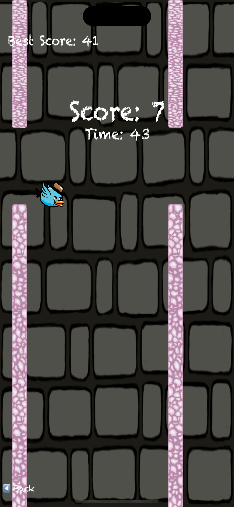

# 🕊️ AirSprint: Sky Duel - Custom Flappy Adventure

A modern and customizable reimagining of the classic Flappy Bird — now with **2-player dueling**, **dynamic obstacles**, and **personalized characters**.

Developed in **Swift + SpriteKit**, this project is tailored for fun gameplay, educational exploration, and real-time mobile interaction.

---

## 📱 Screenshots

| Loading | Game Start | Solo Play | Versus Mode | Custom Bird |
|--------|------------|------------|-------------|-------------|
|  |  |  |  |  |

---

## 🎮 Features

- 🎨 **Custom Character Support**  
  Players can replace the bird with any image from their photo library — even a selfie!

- 🧠 **Dual-Screen Controls**  
  - Tap the **left side** to flap (Player 1 – the flyer)  
  - Tap the **right side** to throw bees (Player 2 – the challenger)

- 🏆 **Real-Time Score Tracking**  
  Score increases as you pass obstacles. Best score is saved with `UserDefaults`.

- 🧱 **Randomized Obstacle Heights**  
  Every session feels new, with randomized obstacle layout and challenge level.

- 🔄 **Replay Friendly**  
  One-tap restart and quick response UI make it endlessly replayable.

- 👦👧 **Kid-Friendly Mode**  
  Simple controls, colorful visuals, and no ads – perfect for younger audiences.

- 💡 **Tutorial Overlay & Info Button**  
  First-time users see a tutorial. A persistent `?` button brings it back any time.

---

## ⚙️ Technologies Used

| Technology     | Purpose                                 |
|----------------|-----------------------------------------|
| **Swift 5**     | Core programming language               |
| **SpriteKit**   | Physics-based 2D game engine            |
| **UIKit**       | Used for image picking and view control |
| **AVFoundation**| Accessing photo library                 |

---

## 🚀 Getting Started

### 🔧 Setup Instructions

1. Clone the repository:
```bash
git clone https://github.com/enesbayri/FlappyBird-Swift.git
cd flappyBird
